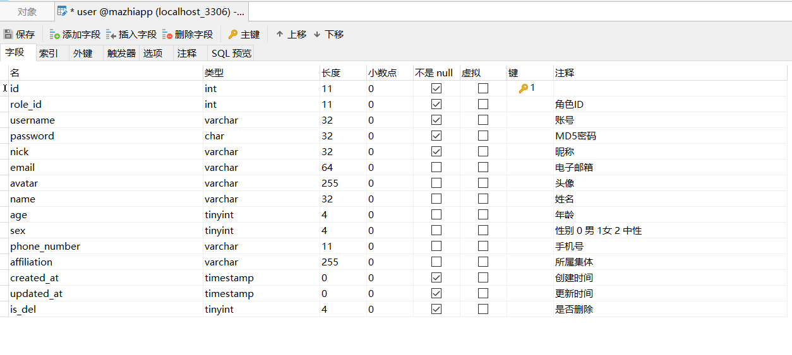
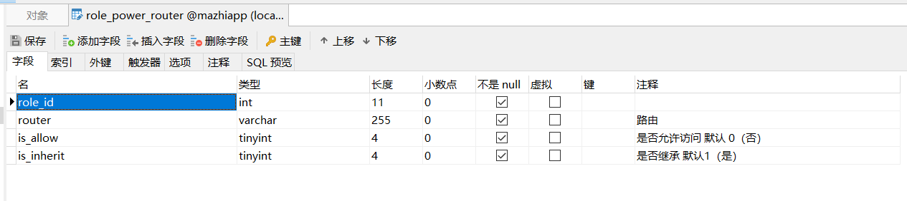
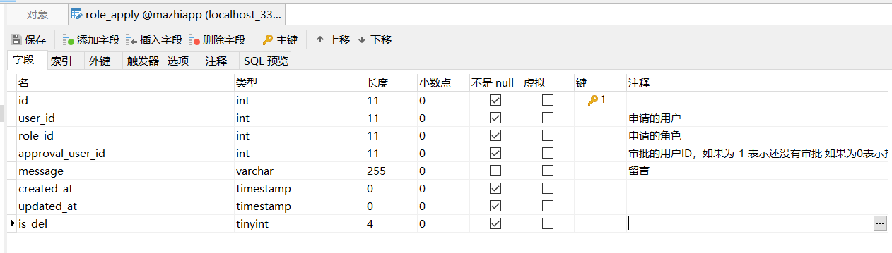
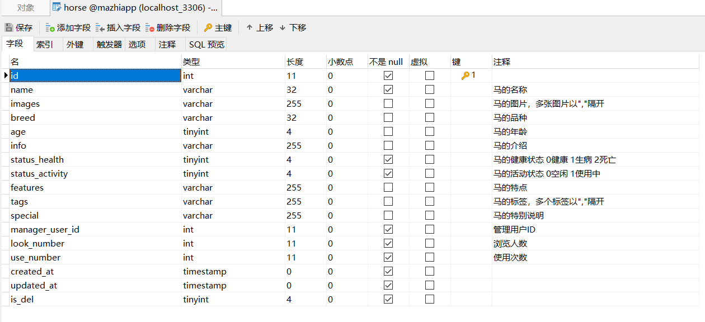
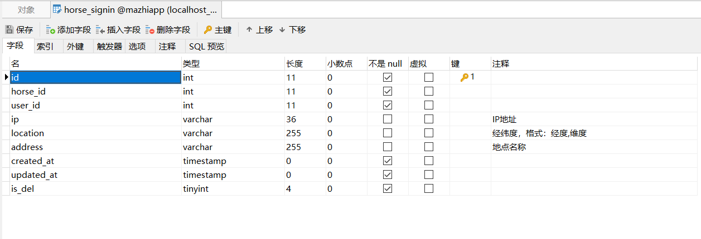
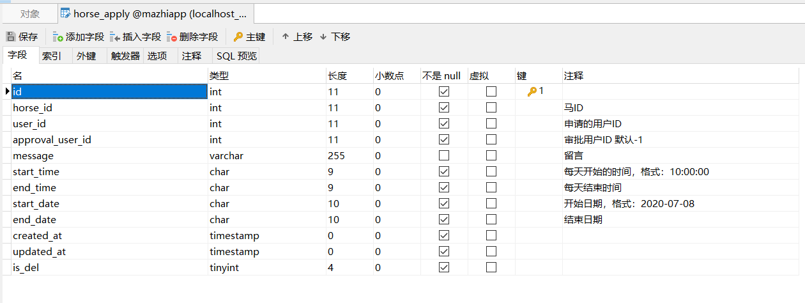
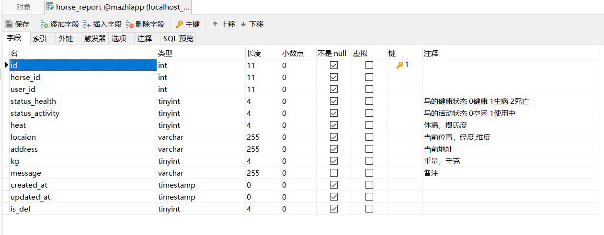
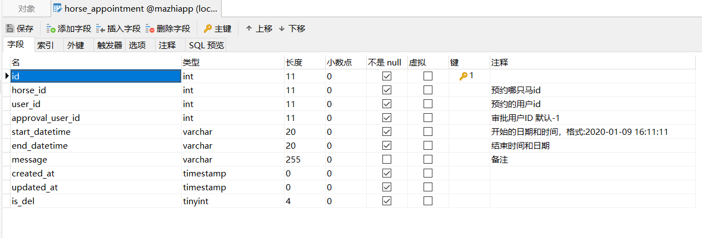
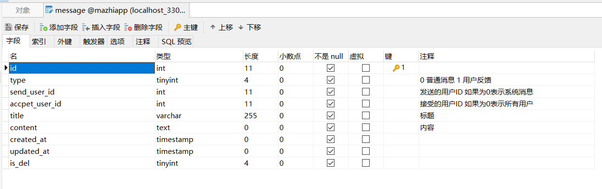
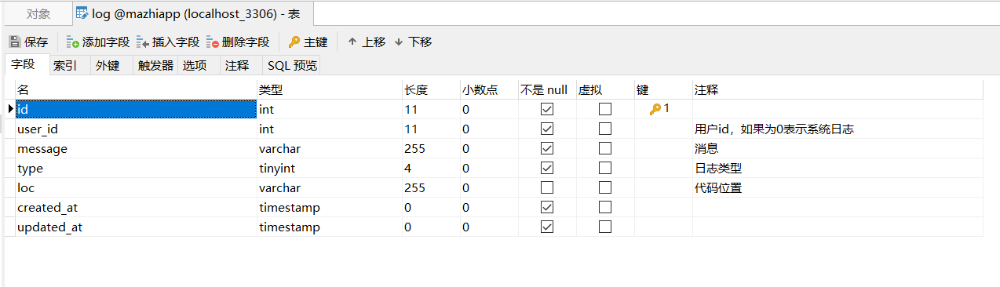

后端开发文档

## 架构设计


## 角色设计

### 超级管理员

### 普通管理员

### 负责人

### 普通用户

### 匿名用户

## 数据库设计

### 用户表



### 角色表


### 角色路由权限表



### 角色申请表



### 马匹表



### 负责人签到表



### 马的负责申请表



### 马的汇报表



### 马的预约表



### 消息表



### 日志表



## API设计

### 说明

- 所有返回数组类型的数据，都应该需要有分页
- 所有api前都应该加上`/api/v1`路由
- 命名使用小驼峰命名

#### 分页

请求

```js
Params{
    pageNum:1, // number 页码
    pageSize:10, // number 每页条数
    order:'id:DESC', //排序
    ...
}
```

响应

```js
{
    pageNum:1, // number 页码
    pageSize:10, // number 页大小
    pageTotal:50, // number 总页数
}
```

#### 头定义

自定义请求头

```
X-Token:'JWT字符串'
```

自定义响应头

```
X-Token:'JWT字符串'
X-Token-Expires:11546156185245 //过期时间戳
```

#### 错误码

```
// 用户错误
1000 用户错误
1001 用户名不存在
1002 密码错误
1003 验证码错误
1004 token无效
1005 token过期
1006 重复请求
1007 用户名已存在
1008 邮箱不正确

// 系统故障
2000 系统故障
2001 系统繁忙
```


### 用户登录

POST /login

条件：匿名用户

请求：

```js
Data:{
    username:'root', // string 用户名
    password:'1234', // string 密码
    code:'yxaw', // string 验证码
}
```

响应：

```js
{
    errcode:0, 
    message:'登录成功',
    data:{
        id:1,
        username:'admin',
        nick:'孤独的管理员',
        email:'189913225@qq.com',
        avatar:'http://.../xxss.jpg',
        name:'张三',
        age:20,
        sex:0,
        phoneNumber:'158xxxx4160',
        affiliation:'计算机技术与信息管理系-17计算机科学与技术乙班',
        createdAt:'2020-01-09 11:11:00',
        updatedAt:'2020-01-10 18:00:00',
        roleName:'管理员',
        router:[ //路由权限
            ...
        ],
    }
}
```

### 验证JWT

GET /jwt

条件：已经登录的用户

请求：

```js
null
```

响应：

```js
{
    errcode:0,
    message:'获取成功',
	data:{
        token:'', //当前的token
        nextToken:'', //下一个token
        createdAt:'', // 创建时间
       	expiresAt:'', // 过期时间
    }
}
```

### 获取用户列表

GET /users

条件：除匿名用户

请求：

```js
null
```

响应：

```js
{
    errcode:0,
    message:'获取成功',
	data:[
        {
            id:1,
            username:'admin',
            nick:'孤独的管理员',
            avatar:'http://.../xxss.jpg',
            sex:0,
            roleName:'管理员',
        }
    ]
}
```

### 获取某一个用户详细信息

GET /users/:id

条件：获取的人必须与被获取用户有一定关系

请求：

```js
null
```

响应：

```js
{
    errcode:0,
    message:'获取成功',
	data:{
        id:1,
        username:'admin',
        nick:'孤独的管理员',
        email:'189913225@qq.com',
        avatar:'http://.../xxss.jpg',
        name:'张三',
        age:20,
        sex:0,
        phoneNumber:'158xxxx4160',
        affiliation:'计算机技术与信息管理系-17计算机科学与技术乙班',
        roleName:'管理员',
    }
}
```


### 修改用户信息

PUT  /users/:id

条件：只能是本人

请求：

```js
Data:{
        nick:'孤独的管理员',
        email:'189913225@qq.com',
        avatar:'http://.../xxss.jpg',
        name:'张三',
        age:20,
        sex:0,
        phoneNumber:'158xxxx4160',
        affiliation:'计算机技术与信息管理系-17计算机科学与技术乙班',
}
```

响应：

```js
{
    errcode:0,
    message:'修改成功',
	data:{
        id:1,
        username:'admin',
        nick:'孤独的管理员',
        email:'189913225@qq.com',
        avatar:'http://.../xxss.jpg',
        name:'张三',
        age:20,
        sex:0,
        phoneNumber:'158xxxx4160',
        affiliation:'计算机技术与信息管理系-17计算机科学与技术乙班',
        roleName:'管理员',
    }
}
```


### 注册

POST /register

条件：需要填入手机号

请求：

```js
Data:{
        username:'admin',
        password:'123456',
        nick:'孤独的管理员',
        email:'189913225@qq.com',
        name:'张三',
        age:20,
        sex:0,
        phoneNumber:'158xxxx4160',
        affiliation:'计算机技术与信息管理系-17计算机科学与技术乙班',
        code:'xstx', //验证码
}
```

响应：

```js
{
    errcode:0,
    message:'注册成功',
	data:{
        id:1,
        username:'admin',
        nick:'孤独的管理员',
        email:'189913225@qq.com',
        avatar:'http://.../xxss.jpg',
        name:'张三',
        age:20,
        sex:0,
        phoneNumber:'158xxxx4160',
        affiliation:'计算机技术与信息管理系-17计算机科学与技术乙班',
        roleName:'管理员',
    }
}
```


### 申请角色

POST /applyForRole

条件：必须是高于或等于被申请角色

请求：

```js
Data:{
    roleId:2, // 申请角色id为2的角色
}
```

响应：

```js
{
    errcode:0,
    message:'注册成功',
	data:{
        id:1,
        username:'admin',
        nick:'孤独的管理员',
        email:'189913225@qq.com',
        avatar:'http://.../xxss.jpg',
        name:'张三',
        age:20,
        sex:0,
        phoneNumber:'158xxxx4160',
        affiliation:'计算机技术与信息管理系-17计算机科学与技术乙班',
        roleName:'管理员',
    }
}
```


### 获取马列表

GET  /horses

条件：所有人都可以访问

请求：

```js
Params:{

}
```

响应：

```js
{
    errcode:0,
    message:'获取成功',
	data:[{
        id:1,
        images:'',
        name:'',
        breed:'',
        tags:'',
        lookNumber:100,
        useNumber:15,
    }]
}
```


### 获取某只马详细信息

GET  /horses/:id

条件：所有人都可以访问

请求：

```js

```

响应：

```js
{
    errcode:0,
    message:'获取成功',
	data:{
        id:1,
        images:'',
        name:'',
        breed:'',
        tags:'',
        age:5,
        info:'',
        statusHealth:0,
        statusActivity:0,
        features:'',
        tags:'',
        special:'',
        managerUser_id:1,
        lookNumber:150,
        useNumber:100,
        createdAt:'',
        updatedAt:'',
    }
}
```


### 获取马的负责人列表

GET  /horses/:id/appointments

条件：所有人都可以访问

请求：

```js

```

响应：

```js
{
    errcode:0,
    message:'获取成功',
	data:[{
        id:1,
        userId:1,
        startTime:'',
        endTime:'',
        startDate:'',
        endDate:'',
        createdAt:'',
    }]
}
```

### 获取某个用户的负责马列表

GET /users/:id/horses

条件：负责人角色

请求：

```js

```

响应：

```js
{
    errcode:0,
    message:'获取成功',
	data:[{
        id:1,
        images:'',
        name:'',
        breed:'',
        tags:'',
        lookNumber:100,
        useNumber:15,
    }]
}
```

### 获取马的汇报日志

GET /horses/:id/logs

条件：所有登录的人

请求：

```js

```

响应：

```js
{	
    errcode:0,
    message:'',
    data:[{
        statusHealth:0,
        statusActivity:0,
        userId:1,
        heat:37,
        kg:200,
        address:'',
        location:'',
        message:'',
        createdAt:'',
	}]
}
```

### 申请成为某只马的负责人

POST /applyForHorse

条件：必须是负责人

请求：

```js
{
    horseId:0
}
```

响应：

```js
{
    errcode:0,
    message:''
}
```


### 负责人签到

POST /signin

条件：负责人

请求：

```js
{
    horseId:1,
    userId:1,
    ip:'',
    location:'',
    address:'',
}
```

响应：

```js
{
    errcode:0,
    message:'',
}
```


### 预约马


### 审批预约


### 汇报马的状态


### 获取用户动态


### 获取信息列表


### 获取详细信息


### 用户反馈


### 获取验证码


### 发送消息


### 审批角色


### 审批马的负责人


### CURD操作API

#### 增


#### 删


#### 改


#### 查


### 统计API

待定


